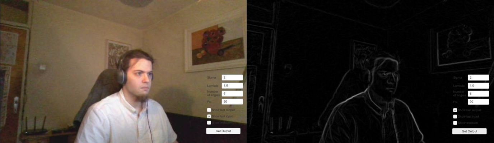

Example Unity project using a C++ plugin using OpenCV.

Captures a webcam frame and displays the output of a Gabor filter bank with equally spaced angles, using the frame capture as input, and the filter parameters set by the user. Could be used as a wrinkle detector, but would require a higher-definition webcam frame, and ideally a segmentation map for the face skin.

Unity project is in unity\_webcam\_wrinkles folder, and CPP code is in wrinkles\_plugin. To rebuild, run cmake on the project and copy wrinkles\_plugin.dll from the build outputs to the unity\_webcam\_wrinkles/Assets/Plugins folder.

Tested only on Windows, with Unity 2018.3.14f1.
